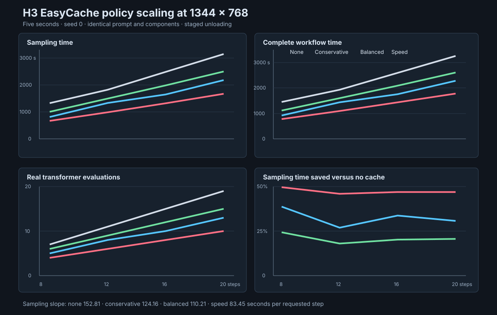
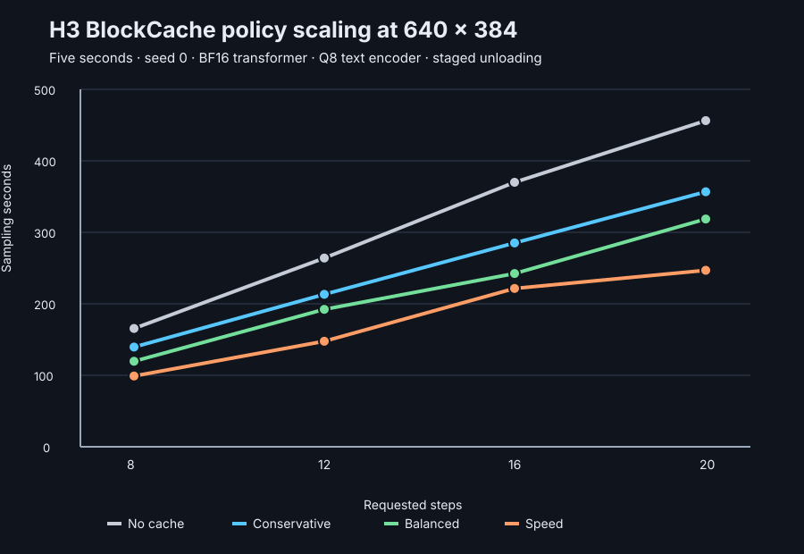

# WeeTodd Nodes

Experimental ComfyUI nodes for running MiniMax H3 natively through MLX on Apple Silicon.

WeeTodd Nodes is an independent MLX-native MiniMax H3 engine and composable ComfyUI node suite. It
provides explicit loaders, reusable model state, generation controls, conditioning tools, memory
controls, quantization, synchronized output, and workflow examples for Apple Silicon.

## Requirements and current scope

- Use an Apple Silicon Mac and macOS.
- Use Python 3.11 or later in the same environment as ComfyUI.
- Install FFmpeg with H.264 video and Advanced Audio Coding (AAC) support.
- Supply the MiniMax H3 transformer, Qwen3-VL text encoder, processor, tokenizer, video variational
  autoencoder (VAE), and audio VAE. The project does not bundle or download models.
- Start with text-to-video-plus-audio (T2VA). First-frame, last-frame, first/last-frame, and
  reference-conditioning nodes are not registered yet.
- Expect no live latent preview in the current sampler. Generated metadata records
  `preview_policy: none`.

## Minimal composable workflow

Build the first graph in this order:

1. Connect **Component Loader** to **Quantized Transformer Loader** when using a named q8 profile.
2. Connect the selected components and **Generation Config** to **Component Preflight**.
3. Connect preflight components to **Text Encode** and enable unloading after encoding.
4. Connect the conditioning, components, and configuration to **Sample Video + Audio Latents**.
5. Optionally connect one LoRA stack and one acceleration node to the sampler.
6. Connect the synchronized latents to **Direct Publish Latents** for staged VAE decode and muxing.

EasyCache, BlockCache, Hierarchical BlockCache, and Trajectory Forecast are mutually exclusive.
Turbo with either BlockCache node requires the explicit experimental opt-in. Use five requested
schedule points for four transformer evaluations. Eight requested schedule points produce seven
transformer evaluations.

## Current nodes

- **WeeTodd H3 Component Loader** creates a lazy specification for the transformer, Qwen3-VL,
  processor, tokenizer, video VAE, and audio VAE.
- **WeeTodd H3 Quantized Transformer Loader** selects an exact `q8_conservative` or `q8_extended`
  recipe, validates its JSON indexes without loading weights, and reports measured memory savings
  and approximation warnings.
- **WeeTodd H3 Component Preflight** validates the manifest, component files, task, configuration,
  and quantization recipe. It estimates staged memory without loading tensor payloads.
- **WeeTodd H3 LoRA Loader (MLX)** builds an ordered, lazy LoRA stack. It validates safetensors
  headers immediately and loads adapter tensors only with the transformer.
- **WeeTodd H3 Text Encode (Qwen3-VL)** produces text-only conditioning from the required
  unnormalized layer-50 state. It omits the vision tower and can unload Qwen3-VL after encoding.
- **WeeTodd H3 Unload Qwen3-VL** explicitly releases a warm process-local conditioner.
- **WeeTodd H3 Sample Video + Audio Latents** runs the transformer over one synchronized packed
  sequence and returns undecoded MLX video and audio latents.
- **WeeTodd H3 EasyCache (MLX)** reuses complete joint video and audio prediction residuals with a
  bounded manual or automatic policy.
- **WeeTodd H3 BlockCache (MLX)** always runs block zero and the current output heads, then reuses
  the cached video and audio residual of later blocks when both modality checks permit reuse.
- **WeeTodd H3 Hierarchical BlockCache (MLX)** splits all 50 blocks into three contiguous segments.
  It always runs each segment anchor and accepts each segment tail independently with joint video
  and audio checks.
- **WeeTodd H3 Trajectory Forecast (MLX)** predicts a bounded future joint video/audio transformer
  result from recent real evaluations. It keeps current timestep output processing active and
  falls back to a real evaluation when its safety checks reject a forecast.
- **WeeTodd H3 Unload Transformer** releases the transformer-only sampler and MLX cache.
- **WeeTodd H3 Decode Video VAE** converts normalized video latents to ComfyUI `IMAGE` frames. It
  checks component provenance and can unload the final video VAE after decoding.
- **WeeTodd H3 Unload Video VAE** explicitly releases a warm process-local video decoder.
- **WeeTodd H3 Decode Audio VAE** converts normalized audio latents to ComfyUI `AUDIO` with one
  batch, two channels, and a 32 kHz sample rate. It retains synchronized timing metadata.
- **WeeTodd H3 Unload Audio VAE** explicitly releases a warm process-local audio decoder.
- **WeeTodd H3 Publish Video + Audio** validates synchronized ComfyUI images and audio, writes a
  collision-safe MP4 atomically, removes temporary files, and emits a JSON metadata sidecar.
- **WeeTodd H3 Direct Publish Latents (MLX)** stages the video and audio VAEs, streams decoded RGB
  chunks directly into FFmpeg, and publishes synchronized MP4 plus metadata without retaining a
  complete ComfyUI `IMAGE` tensor.
- **WeeTodd H3 Model Loader (MLX)** describes a full or quantized checkpoint and loads it lazily.
- **WeeTodd H3 Generation Config** selects a resolution tier and aspect ratio, then validates the
  resolved canvas, duration, steps, seed, AdaLN behavior, and projection backend. Exact custom
  dimensions and the experimental MPP backend remain available as advanced options.
- **WeeTodd H3 Generate Video + Audio** produces a synchronized MP4 and JSON sidecar.
- **WeeTodd H3 Unload MLX Runtime** releases the warm pipeline and cached MLX allocations.

The suite currently registers 22 composable nodes. The first release supports
text-to-video-plus-audio. First/last-frame and multi-reference nodes are next; the engine already
contains much of the keyframe machinery.

## Acceleration and memory controls

The sampler exposes four optional acceleration strategies. **EasyCache** reuses complete joint
predictions, **BlockCache** keeps the first block and output heads live while reusing later-block
residuals, **Hierarchical BlockCache** independently reuses three block tails, and **Trajectory
Forecast** extrapolates a compact joint video/audio feature history.
They are intentionally mutually exclusive so a workflow has one clear approximation policy.

Each strategy offers explicit controls and automatic conservative, balanced, and speed-oriented
policies where applicable. Cache hits and forecasts can change generated pixels or audio; they are
performance/quality tradeoffs, not mathematically exact execution. Turbo LoRA can be combined with
Trajectory Forecast. Turbo can also use either BlockCache node after explicit experimental opt-in.
Every combined accelerator remains experimental.

For memory-constrained systems, select `low_memory_bf16`. This preserves BF16 model precision and
uses staged component unloading, tile-serial VAE decoding, explicit MLX materialization boundaries,
and chunked attention queries. `automatic` currently selects a 512-token query chunk. Manual 512,
1024, and 2048-token choices are available for machine-specific tuning. Low-memory execution is
intended to preserve the generation result; only scheduling and peak live allocations change.

### Exact BF16 MPP projection backend

The advanced `projection_backend` control can select `mpp_experimental` for eligible BF16
transformer projections. This backend executes Metal Performance Primitives (MPP) matrix
multiplication inside MLX-owned custom Metal kernels. Checkpoint weights remain in the MLX model,
LoRA updates remain in activation space, and staged unloading is unchanged.

The backend checks macOS and MLX support before use. It wraps only direct BF16 projections without
a bias. Quantized projections and unsupported layouts continue through standard MLX. The first
call for each runtime shape computes both implementations and requires an exact `mx.array_equal`
result. A failed capability check, kernel execution, or exact comparison permanently selects
standard MLX for that signature.

One Apple M3 Ultra with macOS 26.6 and MLX 0.32.0 completed a five-second 640 by 384 generation with
the BF16 transformer, Q8 text encoder, Turbo LoRA, low-memory staging, and no cache node. Four
transformer evaluations decreased from 101.53 seconds with standard MLX to 89.77 seconds with MPP.
This is an 11.59 percent runtime reduction and a 13.10 percent throughput increase. All 200 eligible
projections were wrapped, four runtime signatures passed exact verification, and no signature used
the fallback.

Decoded video frames matched the standard-MLX control exactly. The published AAC streams were not
byte-identical, but decoded samples had 0.99999985 correlation and a root-mean-square difference of
0.00000069. The MPP path did not reduce measured MLX peak allocation. Keep `mlx` selected when
testing an unsupported Apple GPU or when maximum portability is more important than the measured
speed improvement.

### Hierarchical BlockCache validation

The three-segment speed policy completed q8-extended plus Turbo generations at 640 by 384 and 1344
by 768. Each run reused all three segment tails on one sampling step and skipped 47 of 200 block
executions while retaining all four scheduler evaluations.

At 640 by 384, sampling took 70.85 seconds and the complete workflow took 96.58 seconds. At 1344 by
768, sampling took 582.49 seconds, 13.2 percent less than the 670.80-second no-cache control. The
native cache stored 1.216 GB and increased the complete ComfyUI process peak from 54.74 GB to 58.48
GB. Both outputs contained 124 H.264 frames, stereo 32 kHz AAC, and 8.3 ms audio-video drift. Treat
the speed policy as an explicit quality-memory tradeoff, not a default or low-memory mode.

The first eight-point durability batch covered 20 different realistic stress prompts at 1344 by
768. Every generation completed seven transformer evaluations, reused each segment tail three
times, skipped 141 of 350 cumulative block executions, and retained 8.3 ms audio-video drift.
Sampling averaged 735.12 seconds, with a range of 719.79 through 743.47 seconds. The batch validates
execution and media contracts across diverse prompts; visual equivalence has not been established.

## Generic LoRA and Turbo LoRA support

Put MiniMax H3 LoRA files under `ComfyUI/models/loras/`, then connect **WeeTodd H3 LoRA Loader
(MLX)** to the sampler. Chain loader nodes to apply multiple LoRAs in graph order. The loader
supports standard `lora_A`/`lora_B` and `lora_down`/`lora_up` safetensors naming. Adapters run in
activation space, so small updates are not rounded away by a BF16 or future quantized base model.

The experimental [MiniMax H3 Turbo LoRA](https://huggingface.co/larryvrh/MiniMax-H3-Turbo-Lora)
also targets the original full-width AdaLN timestep path. When the selected H3 transformer is a
pruned curve checkpoint, place `h3_silu_temb_grid.safetensors` from the Apache-2.0
[Turbo node repository](https://github.com/Larryvrh/ComfyUI-MiniMax-H3-Turbo) beside the LoRA, or
select the grid explicitly in the loader. WeeTodd does not bundle or download either file.

For four transformer evaluations, select five requested schedule points. For seven evaluations,
select eight requested schedule points. Start with LoRA strength 1.0 and no accelerator. Enable a
compatible accelerator only after a no-cache control succeeds. The current Turbo checkpoint is
experimental and can produce over-sharp grain, plastic skin, softness, or audio defects.

## Install for development

Clone into `ComfyUI/custom_nodes/WeeTodd-Nodes`, then use the same Python environment as ComfyUI:

```bash
python .agents/skills/python-environment-preflight/scripts/preflight.py \
  --project . --python python --require-architecture arm64
python -m pip install -e .
```

Run the project-local Python environment preflight before replacing a virtual environment or
changing ComfyUI dependencies.

Restart ComfyUI and look under `WeeTodd/H3`.

## Model locations

Point **Component Loader** at a MiniMax H3 partition root that contains `model_index.json`. Use its
optional inputs when the transformer, text encoder, processor, tokenizer, or either VAE is stored
elsewhere. Paths may be absolute at runtime, but workflows intended for sharing should use portable
locations below the ComfyUI model directory.

The named quantized loader resolves profiles below its transformer root:

```text
ComfyUI/models/
├── MiniMax-H3/
│   ├── FL2VA/
│   │   └── model_index.json
│   └── transformers/
│       ├── q8_conservative/
│       └── q8_extended/
└── loras/
    ├── <MiniMax-H3 adapter>.safetensors
    └── h3_silu_temb_grid.safetensors
```

Each named q8 directory must contain its configuration, quantization recipe, shard index, and all
indexed safetensors shards. Preflight and the quantized loader inspect these files before payload
weights load.

## Reality check

H3 is a 33B joint audio/video diffusion transformer plus a large text encoder and two VAEs. MiniMax's initial open release uses dense attention. Native-resolution generation is extremely compute-intensive even on large Apple Silicon systems. Start with the `384P (fast smoke)` tier, 5 seconds, and a low step count to verify wiring before increasing quality.

Resolution selection follows the hosted-node style while resolving to local H3 canvases. Choose a
quality tier (`384P`, `512P`, `768P`, or experimental `2K`) and then choose an aspect ratio from
`21:9` through `9:21`. The `768P (native quality)` and `16:9` selection resolves to H3's established
1344 by 768 canvas. The experimental `2K` tier has a much larger attention and memory cost. Use
Preflight before generation.

The first T2VA baseline uses the unquantized reference precision policy. Most transformer weights
use BF16. The small patch, timestep, and output modules remain FP32 because the audited reference
keeps those stability-sensitive modules in FP32. Current generation testing remains focused on
this BF16-class path; broader base-model quantization is planned for later optimization work.

## Memory measurement guide

Use complete-process physical footprint when deciding whether a workflow fits a Mac. This macOS
kernel measurement includes ComfyUI, Python, mapped checkpoint pages, MLX Metal allocations,
allocator retention, cache state, and decode buffers. The peak is monotonic for the process
lifetime, so each controlled comparison starts a fresh ComfyUI process.

Use MLX peak allocation only to isolate an engine change. Do not compare an MLX-only peak directly
with a complete-process peak.

| Workflow | Canvas | Complete-process peak | Interpretation |
| --- | ---: | ---: | --- |
| BF16, dense attention, no cache | 1280 by 768 | 61.83 GB | BF16 control |
| BF16, 512-row attention chunks | 1280 by 768 | 61.36 GB | Saves 472 MB |
| q8-extended plus Turbo, no cache | 1344 by 768 | 54.74 GB | Four evaluations |
| q8-extended plus Turbo, hierarchical speed | 1344 by 768 | 58.48 GB | Four evaluations; 1.216 GB cache |

The canvas and prompt differ between the BF16 and q8 rows. Use each row as a measured capacity
point, not as a controlled cross-precision comparison. The controlled transformer-only comparison
reduced MLX sample peak from 48.28 GB to 40.26 GB at 1344 by 768, an 8.02 GB reduction.

## Low-memory BF16 results

Endpoint sweeps measured the complete ComfyUI process, including resident model components and
transient MLX allocations. At 640 by 384, 512-token query chunks reduced measured peak memory by
about 204 MiB and increased sampling time by 4.1 percent. At 1280 by 768, the same setting reduced
peak memory by about 472 MiB and increased sampling time by 2.8 percent. Larger chunks produced a
similar memory reduction in these runs, with variable timing overhead.

| Canvas | Attention mode | Complete process peak | Sampling time | Peak saved |
| --- | --- | ---: | ---: | ---: |
| 640 by 384 | Dense | 48.26 GB | 97.49 s | Baseline |
| 640 by 384 | 512-token chunks | 48.06 GB | 101.53 s | 204 MiB |
| 1280 by 768 | Dense | 61.83 GB | 704.42 s | Baseline |
| 1280 by 768 | 512-token chunks | 61.36 GB | 723.94 s | 472 MiB |

These are endpoint measurements on one system, prompt, and seed. They show a modest attention
workspace saving rather than a multi-gigabyte reduction because the complete-process figure also
includes the large resident BF16 model. Strict unloading between the text encoder, transformer,
and VAEs remains the larger memory-management mechanism.

## Experimental mixed-precision checkpoints

`scripts/convert_mixed_checkpoint.py` converts selected transformer modules into standard MLX
affine quantized tensors one source tensor at a time. The output is a directly loadable sharded
checkpoint with a versioned recipe, source SHA-256 identity, tensor inventory, and bounded failure
cleanup. Conversion does not instantiate a second complete transformer in memory.

Choose `--profile q8_conservative` for the 48-module, approximately 4.34 GB recipe. Choose
`--profile q8_extended` for the validated 82-module, approximately 8.02 GB recipe. The quantized
transformer loader rejects a directory whose recorded module overrides do not exactly match the
selected profile.

The real extended conversion produced 37 directly loadable shards and 33.38 GB of tensor storage.
Its maximum conversion buffer was 1.07 GB. Direct loading reconstructed all 82 selected modules
and released their MLX allocation after unload.

A fresh ComfyUI process also completed the native 1344 by 768 Turbo workflow from the sharded
`q8_extended` checkpoint. Four transformer evaluations took 670.80 seconds, or 167.68 seconds per
evaluation. The complete ComfyUI process reached a 54.74 GB physical-footprint peak. Direct
publication produced 124 H.264 frames and stereo 32 kHz AAC with 8.3 ms audio-video drift. The
measurement includes ComfyUI, Python, file mappings, Metal allocations, and transient decode state.

The accepted experimental recipe stores the four core projections in blocks 38 through 49 as
8-bit weights with group size 64. On a harder-motion 640 by 384 validation, it reduced transformer
sample peak from 42.78 GB to 38.45 GB. Runtime remained within run variance. The result preserved
the requested action and composition, but it is not numerically equivalent to BF16.

BlockCache composes with this checkpoint. Balanced used five full evaluations and two cache hits,
reducing transformer time by 27.2 percent; speed used four full evaluations and three hits,
reducing it by 42.5 percent. Both cache policies introduced larger visible changes than q8 alone,
so they remain explicit quality/speed choices.

A projection-specific recipe extends 8-bit precision to both MLP projections in blocks 21 through
37. It saved 8.02 GB of transformer sample peak in a full seven-evaluation 640 by 384 trajectory
and a three-evaluation 1344 by 768 probe. Decoded video reached 22.50 dB and 31.64 dB PSNR,
respectively, while preserving the requested action and final state in both contact sheets.

The extended recipe is an optional experimental low-memory choice, not a published default or a
BF16-equivalent checkpoint. The smaller blocks-38-through-49 recipe remains the conservative q8
choice. Neither recipe demonstrated a repeatable speed improvement.

## Direct MLX publication result

The direct publisher decoded saved 640 by 384 latents into 124 H.264 frames and synchronized 32 kHz
stereo AAC in 23.6 seconds. MLX peak allocation was 7.27 GB, the largest host RGB chunk was 12.5 MB,
and measured pre-encode audio/video drift was 8.3 ms. The path atomically publishes the MP4 and JSON
sidecar, checks interruption between stages, unloads both VAEs, and removes partial files after a
failure.

## EasyCache benchmark results

WeeTodd tested no cache, conservative auto, balanced auto, and speed auto at 8, 12, 16, and 20
requested steps. Every run used the same five-second prompt, seed, model components, and staged
unloading policy. The first matrix used a 640 by 384 smoke-test canvas. The second matrix used the
native-quality 1344 by 768 canvas.

At 20 steps and 1344 by 768, conservative reduced sampling time by 20.6 percent, balanced reduced
sampling time by 30.7 percent, and speed reduced sampling time by 46.9 percent. Speed reduced the
complete workflow from 54.3 minutes to 29.6 minutes. Balanced remained a distinct middle policy at
38.0 minutes.



A complete transformer evaluation stabilized near 165 through 167 seconds at 1344 by 768, compared
with approximately 23 through 26 seconds at 640 by 384. The native canvas has 4.2 times as many
pixels, but an evaluation cost approximately 6.8 times as much. H3's dense attention therefore
makes resolution substantially more expensive than pixel count alone suggests.

These are single-seed performance measurements. Endpoint inspection found the requested robot and
final-wave state in all native-resolution outputs, but the benchmark does not prove motion, detail,
or audio equivalence. See the [local artifact bundle](benchmarks/artifacts/README.md).

## BlockCache benchmark results

The independent MLX BlockCache implementation was tested at 640 by 384 with the same prompt, seed,
components, duration, requested steps, and staged unloading policy as the EasyCache matrix. Every
BlockCache hit still evaluated block zero and the current output heads. A hit took approximately
0.5 seconds, compared with approximately 23 through 24 seconds for a full transformer evaluation.

At 20 requested steps, conservative reduced sampling time by 21.8 percent, balanced reduced
sampling time by 30.2 percent, and speed reduced sampling time by 45.9 percent against the shared
no-cache baseline. The request-local video and audio cache used approximately 95.3 MiB.



All 12 BlockCache outputs contained synchronized video and audio streams. These single-prompt,
single-seed measurements do not prove perceptual equivalence. Generated media remains local under
`benchmarks/artifacts/media/blockcache-384p/`.

## Trajectory Forecast benchmark result

A five-second 640 by 384 Turbo LoRA smoke test compared four real transformer evaluations with the
balanced forecast policy. The forecast run performed three real evaluations and one forecast,
reducing sampling time from 97.49 seconds to 75.43 seconds and complete workflow time from 134.31
seconds to 120.54 seconds. It produced 124 video frames and synchronized 32 kHz stereo audio.

| Mode | Real evaluations | Forecasts | Sampling | Workflow | Complete process peak |
| --- | ---: | ---: | ---: | ---: | ---: |
| No forecast | 4 | 0 | 97.49 s | 134.31 s | 48.26 GB |
| Balanced forecast | 3 | 1 | 75.43 s | 120.54 s | 49.07 GB |

The approximately 772 MiB higher process peak includes forecast history and allocator behavior;
the measured two-snapshot request history itself was about 191 MiB. This single smoke test shows a
useful speed signal, but it does not establish perceptual equivalence or a general quality claim.

Models are never bundled. Detailed project documentation and the OKF knowledge bundle are kept
local and are intentionally excluded from Git.

## Status

Experimental and pre-release. APIs, node names, and workflow compatibility may change.
