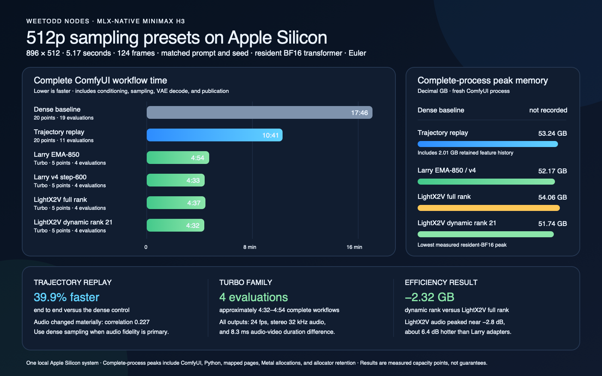

# WeeTodd Nodes

Experimental MLX-native MiniMax H3, LTX 2.3, and LTX 2.5 nodes for ComfyUI on
Apple Silicon.

WeeTodd Nodes keeps the MiniMax H3 engine separate from the ComfyUI adapter. The current release
focuses on synchronized text-to-video-plus-audio generation, staged model unloading, and a
low-memory path that can be tested before enabling optional acceleration.



The matrix compares all six validated sampling policies with clean-speech and fast-motion prompts.
The measured low-memory profile reduced complete ComfyUI process peak by approximately 35 to 39 GB
while increasing workflow time by approximately 5 to 16 percent. See
[Validated sampling presets](#validated-sampling-presets) for the measurement boundary.

## LTX 2.5 distilled MLX workflow

[`ltx25_768x512_distilled_two_stage.json`](workflows/ltx25_768x512_distilled_two_stage.json)
is the starting LTX 2.5 workflow. It follows the official two-stage distilled recipe: eight Euler
ancestral evaluations at half resolution, the learned 2× latent upscaler, then three Euler
ancestral evaluations at full resolution. The default 768 by 512, 121-frame, 24 fps graph produces
synchronized 48 kHz audio and video. It accepts an optional first frame for I2V.

[`ltx25_1920x1088_distilled_two_stage.json`](workflows/ltx25_1920x1088_distilled_two_stage.json)
uses the same quality path at 1920 by 1088. Its first stage runs at 960 by 544 before the learned
2× latent upscale and full-resolution refinement. Use it when final spatial detail matters and the
machine has sufficient unified memory; keep the 768 by 512 workflow as the faster starting point.

Select **Official parity — 768×512, 5 s, reference FP32, 8+3 ancestral** for the validated starting
recipe. The preset keeps the user-selected seed. Select **Custom** before changing its pinned
resolution, duration, memory, prompt-context, or feed-forward fields.

Select **High quality — 1920×1088, 5 s, reference FP32, 8+3 ancestral** for the verified
high-resolution recipe. A matched five-second run with seed 584293325 completed in 599.02 seconds
and produced a 1920 by 1088 H.264 video with stereo 48 kHz AAC audio. Treat that runtime as a
single-machine measurement, not a general performance guarantee.

The project-native loader reads the official split ComfyUI checkpoints directly. It remaps only
verified tensor layouts at load time, so it does not create a second converted copy. The MLX path
uses fast scaled dot-product attention, BF16 computation, staged Gemma → transformer → decoder
unloading, streamed video decode, and optional one-block transformer streaming. Keep
`low_ram_streaming` off for the normal speed-first path; turn it on when transformer residency is
more important than per-evaluation latency.

After accepting the [LTX 2.5 license](https://huggingface.co/Lightricks/LTX-2.5), place these files
in standard ComfyUI model folders. Shared roots configured by `extra_model_paths.yaml` are also
searched.

| ComfyUI folder | Required file |
| --- | --- |
| `ComfyUI/models/diffusion_models/` | `ltx-2.5-22b-distilled-transformer-bf16.safetensors` |
| `ComfyUI/models/text_encoders/` | `gemma4-12b-with-proj-ltx-2.5-bf16.safetensors` |
| `ComfyUI/models/vae/` | `ltx-2.5-video-vae-conv-bf16.safetensors` |
| `ComfyUI/models/vae/` | `ltx-2.5-audio-vae-bf16.safetensors` |
| `ComfyUI/models/latent_upscale_models/` | `ltx-2.5-latent-spatial-upscaler-x2-bf16-1.0.safetensors` |

The first full BF16 Apple-Silicon smoke test completed at 768 by 512, 121 frames, and 24 fps in
96.89 seconds inside the generation node. It used the official 8+3 schedule, staged unloading, and
the normal non-streamed transformer path. MLX peak allocation was 38.13 GiB. The complete fresh
ComfyUI process peaked at 41.25 GiB and returned to 0.57 GiB after unloading. The verified MP4 has
H.264 video and stereo 48 kHz AAC audio. Treat this as an initial functional measurement, not a
cross-project speed or quality claim.

The Generation Config node also exposes `prompt_context`. This value caps real prompt tokens before
Gemma. Gemma encodes those real tokens from position zero. The trained audiovisual connector then
appends learned register tokens to a minimum sequence length of 1024. Earlier adaptive-context
measurements used an incorrect left-padded connector layout and are not valid performance evidence.
Generation metadata records the selected prompt cap and per-evaluation timings.

The optional `bf16_mpp_experimental` video feed-forward backend casts the modulated video
feed-forward inputs to BF16 and uses Metal Performance Primitives for both projections. A matched
same-process run reduced node time from 77.49 to 69.42 seconds, or 10.42 percent. Sampling time fell
11.79 percent. MLX peak allocation fell by approximately 156 MiB. The accelerated trajectory is
not bit-identical and audiovisual coupling changes both video and audio. Keep `reference_fp32` for
reference behavior. Review both picture and sound before selecting the experimental backend.

## Live H3 previews and early failure protection

Use **H3 Component Loader → H3 Model Preview Override → H3 Preflight → H3 Sampler** to see a
true-color six-frame contact sheet after each requested sampling interval. The preview decodes the
predicted clean video latent, so structure becomes clearer as sampling advances. The conservative
guard waits until the schedule midpoint and requires two consecutive low-structure previews before
stopping; non-finite latents always stop immediately. The tiny decoder releases after success,
failure, or cancellation and never replaces the production video VAE.

Download the MIT-licensed `taeh3.safetensors` decoder from
[madebyollin/taehv](https://github.com/madebyollin/taehv/blob/main/safetensors/taeh3.safetensors)
into:

```text
ComfyUI/models/vae_approx/taeh3.safetensors
```

The default `auto` backend uses MLX immediately. On macOS, it prefers an optional fixed-shape Core
ML model when present, which keeps preview convolution off the transformer's Metal execution path.
Install the optional converter runtime into ComfyUI's existing arm64 environment, then make the
portable 256-pixel package:

```bash
COMFYUI_ROOT=/path/to/ComfyUI

"$COMFYUI_ROOT/.venv/bin/python" -m pip install 'coremltools==9.0'
"$COMFYUI_ROOT/.venv/bin/python" \
  "$COMFYUI_ROOT/custom_nodes/WeeTodd-Nodes/scripts/convert_h3_tae_coreml.py" \
  "$COMFYUI_ROOT/models/vae_approx/taeh3.safetensors" \
  "$COMFYUI_ROOT/models/vae_approx/taeh3_coreml_256.mlpackage" \
  --edge 256
```

Core ML is loaded with CPU-and-Neural-Engine compute units, excluding the GPU. If the package or
optional dependency is absent, `auto` records the reason and falls back to MLX. Select `neural
engine` to require Core ML instead. The shipped
[`T2VA smoke workflow`](examples/t2va_smoke_workflow.json) includes this preview node and uses the
conservative guard by default.

## Recommended 768p quality/performance workflow

[`h3_768p_fl2va_staged_turbo_drbaph_v4.json`](workflows/h3_768p_fl2va_staged_turbo_drbaph_v4.json)
is the recommended first-frame workflow when output quality per transformer evaluation matters more
than minimum memory. It generates 1344 by 768 video with one continuous seven-point Euler schedule:
two base-model evaluations establish the composition, then the drbaph v4 step-600 Turbo LoRA runs
for the final four evaluations. The switch does not add noise or start a second sampler. This is a
good balance of native-resolution detail and six-evaluation sampling, but 768p H3 remains expensive:
the measured five-second Q8-paged run completed in 23 minutes 35 seconds on the test system.

Install the
[v4 step-600 EMA adapter file](https://huggingface.co/drbaph/MiniMax-H3-Turbo-Lora-ComfyUI/blob/main/minimax_h3_turbo_v4_step600_ema_pruned_comfyui.safetensors)
from [drbaph/MiniMax-H3-Turbo-Lora-ComfyUI](https://huggingface.co/drbaph/MiniMax-H3-Turbo-Lora-ComfyUI)
at this exact relative path:

```text
ComfyUI/models/loras/minimax_h3_turbo_v4_step600_ema_pruned_comfyui.safetensors
```

```bash
COMFYUI_ROOT=/path/to/ComfyUI

"$COMFYUI_ROOT/.venv/bin/hf" download drbaph/MiniMax-H3-Turbo-Lora-ComfyUI \
  minimax_h3_turbo_v4_step600_ema_pruned_comfyui.safetensors \
  --local-dir "$COMFYUI_ROOT/models/loras"
```

The workflow uses the following portable Component Loader values. They resolve through every
ComfyUI model root, including `extra_model_paths.yaml`; do not replace them with machine-specific
absolute paths.

| Component | Loader value | Source |
| --- | --- | --- |
| FL2VA partition, vision text encoder, processor, tokenizer, and audio VAE | `MiniMax-H3/FL2VA` and its component subdirectories | [MiniMaxAI/MiniMax-H3](https://huggingface.co/MiniMaxAI/MiniMax-H3) |
| Q8-extended paged transformer | `MiniMax-H3/transformers/q8_extended_paged` | [Vayden/MiniMax-H3-MLX-q8-extended-paged](https://huggingface.co/Vayden/MiniMax-H3-MLX-q8-extended-paged) |
| Q8 video VAE | `MiniMax-H3/vae/q8/video_vae_affine_q8.safetensors` | [Vayden/MiniMax-H3-Video-VAE-MLX-Q8](https://huggingface.co/Vayden/MiniMax-H3-Video-VAE-MLX-Q8) |

FL2VA requires the official partition's vision-capable `text_encoder`; the text-only paged Qwen
artifact cannot encode the first frame. The official partition also supplies `model_index.json`,
processor and tokenizer assets, and the audio VAE. The complete download commands and directory
tree are in [Obtain the model components](#obtain-the-model-components). Replace the workflow's
placeholder `first_frame.png` before queuing. The matching API prompt is
[`h3_768p_fl2va_staged_turbo_drbaph_v4_api.json`](examples/h3_768p_fl2va_staged_turbo_drbaph_v4_api.json).

For a complete 15-second T2VA comparison, load either the
[`one-shot staged-Turbo workflow`](workflows/h3_768p_15s_one_clip_staged_turbo.json) or the
[`four-window repaired-chain workflow`](workflows/h3_768p_15s_four_window_join_repair.json).
Both use the same 1344 by 768 canvas, staged adapter, six transformer evaluations per sampling
window, and portable component paths. The one-shot graph preserves the accepted seed `20260811`
and exact prompt from the measured quality baseline. The chain uses seed `20260812`, so its speed
and memory measurements are useful capacity results but not a same-seed quality comparison. The
chain is the faster and lower-peak experimental option and includes synchronized publication.

[`h3_768p_15s_ref2va_aliens_staged_turbo.json`](workflows/h3_768p_15s_ref2va_aliens_staged_turbo.json)
adapts the accepted one-shot schedule to strict two-image Ref2VA. It expects
`tall_white_reference_sheet.png` as Picture 1 and `grey_alien_reference_sheet.png` as Picture 2 in
the ComfyUI input directory. Reference media is not bundled. The graph requires a genuine Ref2VA
partition at `MiniMax-H3/Ref2VA`; its FL2VA compatibility switch remains disabled. It uses visual
reference strength `0.999`, audio strength `1.0`, seed `20260811`, and the same two-base plus
four-Turbo schedule as the accepted T2VA baseline. The matching API prompt is
[`h3_768p_15s_ref2va_aliens_staged_turbo_api.json`](examples/h3_768p_15s_ref2va_aliens_staged_turbo_api.json).
The corresponding
[`four-window Ref2VA chain`](workflows/h3_768p_15s_ref2va_aliens_chained_staged_turbo.json)
adds the same two character sheets to every window and carries both synchronized latent context
and an ordered prior-video reference. Its matching API prompt is
[`h3_768p_15s_ref2va_aliens_chained_staged_turbo_api.json`](examples/h3_768p_15s_ref2va_aliens_chained_staged_turbo_api.json).

## Current scope

- Apple Silicon and macOS
- Python 3.11 or later in the ComfyUI environment
- MLX 0.32.0 or later
- Text-to-video-plus-audio (`t2va`)
- Experimental first-frame, last-frame, and combined first/last-frame (`fl2va`) conditioning
- Experimental ordered image, video, soundtrack, and audio reference (`ref2va`) conditioning
- Experimental latent-native motion continuation for dense T2VA and FL2VA sampling
- Visual first, last, and numbered middle-frame FL2VA conditioning at exact 24 fps positions
- Sparse timed FL2VA keyframes with local-window or global chained-timeline timestamps
- Direct staged publication of complete latent chains with synchronized overlap removal
- Experimental 2.5-to-5-second short windows for chained-generation tests
- Experimental H3-native 1.5x or 2x latent Hi Res Fix with original-audio preservation
- Independent visual and audio reference-strength control
- Synchronized H.264 video and 32 kHz stereo AAC audio
- 42 composable nodes under `WeeTodd/H3`
- Optional standalone LTX 2.3 T2VA and I2VA pipelines under `WeeTodd/LTX 2.3`
- Five distilled-model nodes under `WeeTodd/LTX 2.5`; direct official split-checkpoint loading,
  packed Gemma 4 conditioning, the official 8+3-evaluation two-stage schedule, convolutional video
  VAE, 48 kHz audio decode, learned latent upscaling, staged unloading, and optional block streaming
  are implemented. First-render parity and performance remain experimental.
- Learned LTX latent upscaling for decoded H3 `IMAGE` plus `AUDIO`

## Node catalog

This table is generated from the registered node contracts. Update the node description and
maturity policy when behavior changes, then run `scripts/update_readme_node_catalog.py`. The
README and workflow commit gate rejects a stale catalog.

<!-- BEGIN GENERATED NODE CATALOG -->
| Node | Notes | Category | Status |
| --- | --- | --- | --- |
| H3 Component Loader | Describe every MiniMax H3 component. This node does not load tensor weights. | H3 — Loaders | Recommended |
| H3 Model Preview Override | Attach a true-color TAE preview and optional collapse guard to H3 sampling. Core ML can keep preview decoding on the Apple Neural Engine; MLX remains the fallback. Place this node between the component loader and sampler. | H3 — Sampling and acceleration | Experimental |
| H3 Quantized Transformer Loader | Select and validate a named mixed-precision H3 transformer without loading weights. Both q8 profiles are approximate and keep BlockCache disabled by default. | H3 — Loaders | Experimental |
| H3 Component Preflight | Validate MiniMax H3 components and estimate staged memory from file headers. Set available memory to zero when unknown. | H3 — Loaders | Recommended |
| H3 First Frame | Use one image as the first-frame endpoint for an FL2VA generation. | H3 — Conditioning | Supported |
| H3 Last Frame | Use one image as the last-frame endpoint for an FL2VA generation. | H3 — Conditioning | Supported |
| H3 First + Last Frame | Use two images as the first-frame and last-frame endpoints for FL2VA. | H3 — Conditioning | Supported |
| H3 Chained Timeline | Map global timestamps onto equal-length H3 windows and define exact overlap trimming. | H3 — Continuation | Experimental |
| H3 Frames | Select first, last, and up to six numbered middle images in one visual frame strip. Frame numbers are one-based; the last frame follows the connected generation duration. | H3 — Conditioning | Supported |
| H3 Timed Keyframe | Append an FL2VA image at an exact 24 fps local timestamp, or map a global chained timeline timestamp into one window. | H3 — Conditioning | Experimental |
| H3 Reference Image | Append an image identity, subject, style, or scene reference. Reference order controls the prompt labels and packed rotary positions. A 100% pixel budget matches the output canvas area; lower values reduce persistent reference tokens and higher values retain more source detail. | H3 — Conditioning | Supported |
| H3 Reference Video | Append a video motion and camera reference, with an optional synchronized soundtrack. Supply the source frame rate explicitly. The recommended default matches the output pixel area; native reference resolution is available but can be dramatically slower. | H3 — Conditioning | Experimental |
| H3 Reference Audio | Append a standalone voice, sound, or music reference. Ref2VA also requires at least one image or video reference. | H3 — Conditioning | Supported |
| H3 Encode First / Last Frames | Encode FL2VA prompt vision rows and first/last-frame VAE rows in separate staged phases. Each weighted component unloads before the next phase. | H3 — Conditioning | Supported |
| H3 Encode Timed Keyframes | Encode up to eight sparse FL2VA images at exact 24 fps timestamps, unloading Qwen3-VL before the video VAE stage. | H3 — Conditioning | Experimental |
| H3 Encode References | Prepare ordered Ref2VA media, then stage Qwen3-VL, the video VAE, and the audio VAE. Each weighted component unloads before the next stage. | H3 — Conditioning | Experimental |
| H3 Reference Strength | Adjust how strongly FL2VA or Ref2VA trusts visual and audio condition rows. Defaults preserve the released H3 behavior. | H3 — Conditioning | Experimental |
| H3 Text Encode (Qwen3-VL) | Encode a text-only H3 prompt with Qwen3-VL. The vision tower stays unloaded. The encoder can unload after it produces conditioning. | H3 — Conditioning | Recommended |
| H3 Unload Qwen3-VL | Release the process-local Qwen3-VL conditioner and clear the MLX cache. | H3 — Conditioning | Supported |
| H3 Motion Continuation Context | Copy a synchronized tail from H3 video and audio latents for motion continuation. The recommended 22-frame overlap is about 0.92 seconds at 24 fps. | H3 — Continuation | Experimental |
| H3 Append Latent Chain Window | Append one synchronized latent window to a validated H3 chained timeline. | H3 — Continuation | Experimental |
| H3 Sample Video + Audio Latents | Sample synchronized MiniMax H3 video and audio latents with MLX. This node does not load or run either VAE. | H3 — Sampling and acceleration | Recommended |
| H3 Latent Hi Res Fix | Enlarge an H3 video latent and run a second H3 visual refinement pass. The original synchronized audio latent is returned unchanged. | H3 — Sampling and acceleration | Experimental |
| H3 LoRA Loader (MLX) | Build a lazy, ordered MiniMax H3 LoRA stack. Validate safetensors headers now and load adapter tensors only when the H3 transformer executes. | H3 — Loaders | Supported |
| H3 Validated Sampling Preset | Apply a measured dense, trajectory-replay, or Turbo sampling policy. Connect all three typed outputs to the H3 sampler. | H3 — Sampling and acceleration | Recommended |
| H3 EasyCache (MLX) | Configure joint MLX EasyCache residual reuse for H3 video and audio sampling. Choose quality-first, balanced, or speed-first bounded automatic reuse. | H3 — Sampling and acceleration | Experimental |
| H3 Trajectory Forecast (MLX) | Experimentally forecast compact post-transformer H3 video and audio features. Current timestep output heads still run on every step. Turbo LoRA is supported. | H3 — Sampling and acceleration | Experimental |
| H3 BlockCache (MLX) | Always run H3 block zero and the current output heads, then safely reuse the cached joint audio/video residual of later transformer blocks when both modality indicators agree. | H3 — Sampling and acceleration | Experimental |
| H3 Hierarchical BlockCache (MLX) | Split the 50 H3 blocks into three contiguous segments. Always evaluate each segment's anchor block, accept video and audio together, and reuse eligible segment tails independently. | H3 — Sampling and acceleration | Experimental |
| H3 Unload Transformer | Release the process-local H3 transformer and clear the MLX cache. | H3 — Sampling and acceleration | Supported |
| H3 Decode Video VAE | Decode the video stream from synchronized H3 latents with the final video VAE. The audio latent stream remains available on the original latent output. | H3 — Decoding | Supported |
| H3 Unload Video VAE | Release the process-local H3 video VAE and clear the MLX cache. | H3 — Decoding | Supported |
| H3 Decode Audio VAE | Decode the audio stream from synchronized H3 latents as 32 kHz stereo audio. The video latent stream remains available on the original latent output. | H3 — Decoding | Supported |
| H3 Unload Audio VAE | Release the process-local H3 audio VAE and clear the MLX cache. | H3 — Decoding | Supported |
| H3 Trim Continuation Overlap | Remove the repeated motion-continuation overlap from decoded video and audio, then normalize audio to the exact remaining video duration. | H3 — Continuation | Experimental |
| H3 Publish Video + Audio | Validate and publish synchronized H3 images and 32 kHz stereo audio as MP4. The node writes an atomic JSON metadata sidecar. | H3 — Output | Supported |
| H3 Direct Publish Latents (MLX) | Decode synchronized H3 latents directly to MP4 through staged MLX VAEs. The node avoids a persistent ComfyUI IMAGE tensor and unloads each VAE after use. | H3 — Output | Recommended |
| H3 Direct Publish Chained Timeline (MLX) | Decode an H3 latent chain by VAE stage, remove duplicated joins, force exact 24 fps / 32 kHz duration, and atomically publish one MP4. | H3 — Output | Experimental |
| H3 Model Loader (MLX) | Describe an MLX MiniMax H3 checkpoint. Weights load lazily at generation time. | H3 — Core and convenience | Legacy/convenience |
| H3 Generation Config | Choose a clearly labeled aspect ratio and move the short-edge size slider, or use exact dimensions. The live canvas remains on H3's required 32-pixel grid. | H3 — Core and convenience | Recommended |
| H3 Generate Video + Audio | Generate synchronized video and audio with MiniMax H3 through MLX. | H3 — Core and convenience | Legacy/convenience |
| H3 Unload MLX Runtime | Release state held by the monolithic H3 runtime. | H3 — Core and convenience | Legacy/convenience |
| LTX 2.3 Model Loader (MLX) | Select a local LTX 2.3 MLX bundle. No weights load in this node. | LTX 2.3 — Loaders | Supported |
| LTX 2.3 Generation Config | Configure LTX 2.3 mode, canvas, duration, steps, guidance, and memory policy. | LTX 2.3 — Core | Supported |
| LTX 2.3 Preflight | Validate the selected LTX 2.3 bundle and mode-specific components before allocation. | LTX 2.3 — Loaders | Recommended |
| LTX 2.3 Generate Video + Audio | Generate synchronized LTX 2.3 video and 48 kHz stereo audio through MLX. | LTX 2.3 — Core | Experimental |
| LTX 2.3 Upscaler Loader | Select and preflight a learned LTX 2.3 spatial latent upscaler. | LTX 2.3 — Loaders | Experimental |
| LTX 2.3 Upscale + Publish | Upscale decoded H3 or other ComfyUI video frames with the LTX latent upscaler and preserve the supplied audio. | LTX 2.3 — Upscaling | Experimental |
| LTX 2.3 Unload MLX Runtime | Release the process-local LTX 2.3 pipeline. | LTX 2.3 — Core | Supported |
| LTX 2.5 Component Loader (MLX) | Select LTX 2.5 split components without loading weights or downloading files. | LTX 2.5 — Loaders | Experimental |
| LTX 2.5 Generation Config | Configure the official distilled 8+3-evaluation LTX 2.5 two-stage schedule. | LTX 2.5 — Core | Experimental |
| LTX 2.5 Preflight | Validate LTX 2.5 component metadata and architecture requirements before allocation. | LTX 2.5 — Loaders | Experimental |
| LTX 2.5 Generate Video + Audio | Generate synchronized LTX 2.5 video and audio through the MLX adapter. | LTX 2.5 — Core | Experimental |
| LTX 2.5 Unload MLX Runtime | Release process-local LTX 2.5 state. | LTX 2.5 — Core | Supported |
<!-- END GENERATED NODE CATALOG -->

The FL2VA path stages Qwen3-VL vision and video-VAE encoding before transformer sampling. The
Ref2VA path stages media preparation, Qwen3-VL vision, video-VAE encoding, audio-VAE encoding, and
transformer sampling. Each weighted component unloads before the next low-memory stage. A genuine
Ref2VA checkpoint remains the intended strict path, but it is not generation-validated in this
release. One separately compressed Ref2VA checkpoint produced invalid low-variance video at both
eight and 20 requested schedule points and was rejected. The Component Loader also offers an
advanced, explicit FL2VA-to-Ref2VA compatibility switch for comparisons when only FL2VA weights
are installed. That switch is off by default: the official partitions share transformer
architecture and sampling shifts but contain different learned weights.

Reference images use an output-relative pixel budget. The 100-percent default matches the output
canvas area while preserving the source aspect ratio. Values from 50 to 400 percent trade
reference-token cost against source detail; they do not change the output resolution.

Reference videos provide an additional **temporal density** control. Keep **all frames
(recommended)** when fidelity has priority. The experimental 50-percent and 25-percent options
uniformly reduce only the frames sent to the video VAE. Qwen3-VL still inspects the complete
reference clip, and the packed reference retains the original timeline. A matched 640 by 384
Ref2VA test reduced mean transformer time from 75.54 seconds per evaluation to 53.29 seconds at
50-percent density and 42.86 seconds at 25-percent density. The preferred drbaph Step-600 v4
adapter averaged 53.15 seconds at 50-percent density. The tested moderate-motion scene retained
both subjects and coherent action, but harder motion, lip sync, cuts, and long references still
require validation. Full density therefore remains the default.

Place **Reference Strength** after the FL2VA or Ref2VA encoder to adjust how strongly the sampler
trusts its prepared condition rows. Visual strength defaults to `0.999`; audio strength defaults to
`1.0`. Lower values add more seeded noise to that modality. Start with visual values from `0.7` to
`0.999`. Values below `0.7` can weaken the FL2VA last-frame anchor. Lowering either value can alter
generated audio because H3 evaluates audio and video jointly. Keep the seed, prompt, and all other
settings fixed when comparing strengths.

Start with [`fl2va_first_frame_workflow.json`](examples/fl2va_first_frame_workflow.json) for image-
to-video-plus-audio or [`ref2va_image_workflow.json`](examples/ref2va_image_workflow.json) for one
ordered image reference. Replace the placeholder input image and edit the prompt before queuing.

For several visual anchors in one clip, use **H3 Frames** with **Encode Timed Keyframes**. The
Frames editor starts with First and Last slots. Select a row or bottom thumbnail to show that image
in the large preview, and use **Add Frame** for up to six middle images. Enter middle positions as
one-based frame numbers: `001` is First, while Last follows the aligned frame count from the
connected Generation Config. This keeps the endpoint correct when duration changes. Duplicate
positions, missing images, and middle positions outside the clip fail before model loading.

## Motion continuation

Use **Motion Continuation Context** to copy a synchronized video-and-audio latent tail from one H3
generation. Connect the continuation output to the next **Sample Video + Audio Latents** node. The
quality-first default is 22 frames, or approximately 0.92 seconds at 24 fps. Shorter context is
faster but can weaken motion and identity continuity at the join.

Use **Chained Timeline** to define equal-length windows, overlap, and an exact final duration. Add
one or more **Timed Keyframe** nodes before **Encode Timed Keyframes**. A keyframe can use a local
window timestamp or a global timeline timestamp plus its one-based window index; the node maps the
global value to an exact zero-based 24 fps frame. The engine places that image at
`text_origin + 5/3 × frame` on H3's shared rotary clock. Continuation rows remain a separate,
fully trusted group, so adding a timed image does not weaken or renoise the copied latent head.

Append every sampled window with **Append Latent Chain Window**, then publish the complete chain
with **Direct Publish Chained Timeline**. Publication holds only one VAE stage at a time, streams
decoded RGB chunks directly to the encoder, searches each repeated video head for the lowest-cost
motion-aligned join, applies a four-frame cosine blend, and uses a synchronized 50-millisecond
audio crossfade. It then applies the requested final-frame trim, validates A/V drift, and
atomically emits one MP4 plus JSON metadata.

[`h3_512p_timed_two_window_staged_turbo_api.json`](examples/h3_512p_timed_two_window_staged_turbo_api.json)
is a portable API example of the complete contract. Replace both placeholder images before
queuing. It uses one local first-frame anchor, one global-timeline anchor in window two, a 22-frame
overlap, and the staged drbaph schedule of two base evaluations plus four Turbo evaluations.

A 2.5-second request is experimental and aligns to 73 frames. Two such windows with a 22-frame
overlap produce 124 assembled frames: 73 frames from the first window and 51 new frames from the
second window, or approximately 5.17 seconds total at 24 fps.

Decode the second generation, then connect its `IMAGE`, `AUDIO`, and continuation outputs to
**Trim Continuation Overlap**. The trim node removes the repeated video head, removes the matching
audio samples, and normalizes audio to the exact remaining video duration. Connect `trim_info` to
the publisher's `media_timing_info` input. Join the first decoded clip and the trimmed second clip
with standard ComfyUI media nodes.

The continuation path has these limits:

- Use a T2VA or FL2VA checkpoint and the same checkpoint, canvas, frame rate, and sample rate for
  every window. Timed keyframes require FL2VA.
- Use dense sampling or connect **Trajectory Forecast**. EasyCache and BlockCache remain rejected.
- Keep `conditioned_row_policy` at `target_only` for chained context. The forecast guard and archive
  then exclude fixed context rows whose output predictions the scheduler discards.
- Enable `offline_smoothing_replay` for the guarded replay path. Keep `offline_audio_blend` at zero
  for the audio-isolation default, but compare against dense output when seed-specific audio matters.
- Select 5, 22, 39, or 56 context frames. These values match the H3 temporal latent grid.
- Use no more than eight sparse timed keyframes in one window. Duplicate resolved frames and
  timestamps outside the selected window fail before weighted execution.
- Treat the feature as experimental while broader prompts and longer chains remain untested.

The continuation object contains copied MLX latents. The path does not decode and re-encode the
overlap, which avoids an extra VAE pass and its reconstruction loss.

The first timed-chain validation used two 107-frame windows at 896 by 512. A global 5.5-second
anchor mapped to local frame 47 in window two and landed at published frame 132. After removing the
22-frame overlap, the direct publisher emitted 192 frames and exactly 256,000 pre-mux audio samples:
8.000 seconds of 24 fps video and 32-kHz stereo audio with zero measured drift. The visual join
retained the intended direction and scene, but this was a small first validation rather than a
general continuity guarantee.

The repaired four-window staged-Turbo validation used 1344 by 768, the same 22-frame overlap,
seven requested schedule points, and six real transformer evaluations per window. The assembled
timeline was trimmed to 360 frames. Direct staged publication emitted exactly 15.000 seconds of
video and 480,000 pre-mux audio samples with zero measured drift. Transformer sampling took 14.13,
21.46, 21.56, and 20.13 minutes by window; staged publication took 6.94 minutes. Motion matching
reduced the selected seam error at all three joins, and the audio crossfade reduced each entry
discontinuity. Frame-to-frame motion immediately after joins one and three remained higher than
the selected seam, so perceptual review is still required.

The matching one-shot staged-Turbo control used one 15.08-second request and the same canvas and
sampling schedule. Its complete workflow took 2 hours 16 minutes 48 seconds and reached 28.67 GiB
of MLX peak allocation. The repaired chain completed in 1 hour 24 minutes 49 seconds and reached
13.46 GiB, making it 1.61 times faster with 53 percent lower measured MLX peak on this system.
These are single-system experimental measurements, not complete ComfyUI process peaks or general
performance guarantees.

Ready-to-load 15-second comparison graphs and API prompts are:

- [`h3_768p_15s_one_clip_staged_turbo.json`](workflows/h3_768p_15s_one_clip_staged_turbo.json)
- [`h3_768p_15s_one_clip_staged_turbo_api.json`](examples/h3_768p_15s_one_clip_staged_turbo_api.json)
- [`h3_768p_15s_four_window_join_repair.json`](workflows/h3_768p_15s_four_window_join_repair.json)
- [`h3_768p_15s_four_window_join_repair_api.json`](examples/h3_768p_15s_four_window_join_repair_api.json)

The first real-checkpoint smoke test used 672 by 384 output, 124 frames per generated window,
eight requested Euler points, a resident BF16 transformer, and no acceleration. The base window
averaged 23.82 seconds per transformer evaluation. The continuation window averaged 29.66 seconds,
or 24.5 percent longer, because the packed sequence included the fixed context rows. The trim node
published 102 frames and 136,000 audio samples with zero pre-encode audiovisual drift. A boundary
contact sheet preserved the courier, bicycle, market, pose, and apple position across the join.
Treat this result as a wiring and first-quality smoke test, not a guarantee for longer chains.

The first four-window Trajectory Forecast chain used 960 by 544 output, a 22-frame overlap,
20 requested Euler points, resident BF16 weights, no LoRA, automatic-speed offline replay, and
`target_only`. Every window used 11 actual transformer evaluations and eight forecasts with zero
fallbacks. Sampling took 12.15, 15.26, 14.99, and 15.75 minutes. The complete ComfyUI graph took
1 hour 2 minutes 45 seconds, including four text encodes, all decodes, trims, and publications.

Each target-only replay archive used 2.281 GB. Continuation windows excluded 3,570 fixed video rows
and 74 fixed audio rows from every anchor. At this shape and schedule, that exclusion saves an
estimated 0.325 GB, or 12.5 percent, compared with archiving all rows. The final assembly contains
360 frames and exactly 15 seconds of 32-kHz stereo audio. Treat these measurements as one
experimental chain result, not a dense matched control.

Two ready-to-load 960 by 544 chained workflows reproduce the measured policies:

- [`h3_544p_chained_dense_turbo_rank21.json`](workflows/h3_544p_chained_dense_turbo_rank21.json)
  uses the LightX2V rank-21 Turbo LoRA with five requested points and four transformer evaluations
  per window.
- [`h3_544p_chained_trajectory_replay.json`](workflows/h3_544p_chained_trajectory_replay.json)
  uses 20 requested points, target-only Trajectory Forecast, offline replay, and no LoRA. Each
  window can use up to 11 transformer evaluations.

Each graph generates four source clips, retains 22 latent context frames between clips, trims the
repeated video and audio from clips two through four, and publishes four synchronized MP4 files.
The graph keeps the transformer resident between windows and unloads it after the fourth sample.
Install the named Turbo adapter before running the dense Turbo graph. Join the four published MP4
files with a media-concatenation node or external editor; WeeTodd does not assume a specific
third-party ComfyUI video-node package.

## H3 latent Hi Res Fix

Connect completed **Sample Video + Audio Latents** output to **Latent Hi Res Fix** to enlarge the
video in H3 latent space and run a partial second H3 denoise pass. The node reuses the suite's
existing conditioning and reference objects, so a source generated with first/last frames or
Ref2VA can retain the same conditioning during refinement. It does not decode and re-encode the
source video.

The balanced option enlarges each axis by approximately 1.5x, rounded to H3-compatible multiples
of 32. For example, 640 by 384 becomes 960 by 576. The experimental 2x option processes four times
the source spatial latent area and is more likely to alter lettering, thin lines, composition, or
small details. The target remains subject to the 1920-pixel axis and 1088-pixel short-edge limits.

Select **bilinear**, **nearest exact**, **bicubic**, or **lanczos-3** latent resizing. Bilinear is
the compatibility default. Nearest exact preserves source latent vectors without averaging.
Bicubic uses MLX-native Catmull-Rom interpolation. Lanczos-3 uses normalized, separable six-tap
weights for sharper band-limited interpolation without a dense resize matrix. Bicubic and Lanczos
can overshoot latent values and must be validated for the selected denoise strength. All methods
resize only the spatial video latent axes; temporal and audio latents remain unchanged.

H3 evaluates video and audio jointly, so the refinement pass uses a temporary audio working latent
to preserve the transformer's audiovisual contract. That temporary result is discarded. The node
returns the original first-pass audio latent unchanged and records `audio_preserved: true` in its
metadata. Decode and publish the refined latent normally; no LTX model or pixel-space stretcher is
used. When using separate video/audio decode nodes, connect the Hi Res Fix `refined_config` output
to **Publish Video + Audio** so its dimension checks use the enlarged canvas. **Direct Publish
Latents** reads the refined configuration from the latent object automatically.

Start with 1.5x, five requested refinement schedule points, and strength 0.35. Increasing strength
uses an earlier, noisier suffix of the schedule and permits more reconstruction, but can drift
farther from the source. Spatial token and activation work scales approximately with pixel area:
1.5x is about 2.25x the source area, while 2x is 4x. Use staged unloading or low-memory BF16 when
the target would otherwise exceed unified memory. This path is experimental until real-checkpoint
visual comparisons establish stronger defaults.

The composable API example
[`h3_native_hires_fix_1p5x_api.json`](examples/h3_native_hires_fix_1p5x_api.json) runs an eight-point
640 by 384 source pass, refines its video latent at 960 by 576, preserves the source audio latent,
and publishes directly without retaining a full ComfyUI `IMAGE` tensor.

## Install

Clone the project into the ComfyUI custom-node directory. Install it with the same Python
interpreter that runs ComfyUI.

```bash
COMFYUI_ROOT=/path/to/ComfyUI

git clone https://github.com/wee-todd/WeeTodd-Nodes.git \
  "$COMFYUI_ROOT/custom_nodes/WeeTodd-Nodes"

"$COMFYUI_ROOT/.venv/bin/python" -m pip install -e \
  "$COMFYUI_ROOT/custom_nodes/WeeTodd-Nodes"
```

Install FFmpeg with H.264 encoding and Advanced Audio Coding (AAC) support. Restart ComfyUI and
confirm that the `WeeTodd/H3` category is present.

LTX 2.3 is optional. Install the pinned MLX runtime only when those nodes are needed:

```bash
"$COMFYUI_ROOT/.venv/bin/python" -m pip install -e \
  "$COMFYUI_ROOT/custom_nodes/WeeTodd-Nodes[ltx]"
```

Restart ComfyUI and confirm that `WeeTodd/LTX 2.3` is present. The optional dependency is pinned
to a tested `ltx-2-mlx` revision because its pre-1.0 pipeline API can change.

## LTX 2.3 standalone generation

Load [`ltx23_t2va_two_stage.json`](workflows/ltx23_t2va_two_stage.json) for the initial standalone
LTX 2.3 graph. The matching API prompt is
[`ltx23_t2va_two_stage_api.json`](examples/ltx23_t2va_two_stage_api.json).

The graph contains four executable nodes plus one setup note:

| Order | Node | Purpose |
| ---: | --- | --- |
| 1 | LTX 2.3 Model Loader | Select one complete local MLX model bundle and Gemma encoder. |
| 2 | LTX 2.3 Generation Config | Select pipeline, canvas, duration, steps, guidance, and memory policy. |
| 3 | LTX 2.3 Preflight | Reject missing mode-specific components before allocating weights. |
| 4 | LTX 2.3 Generate Video + Audio | Run T2VA, or I2VA when a first frame is connected, and publish MP4. |

The supported generation modes are:

| Mode | Use |
| --- | --- |
| `two_stage` | Recommended quality baseline: dev model, half-resolution sampling, learned 2x upscale, and refinement. |
| `two_stage_hq` | Quality-first second-order stage-one sampling. |
| `distilled` | Faster distilled two-stage generation when the model bundle includes distilled weights. |
| `one_stage` | Full-resolution dev-model sampling without the learned upscale stage. |

Set each step field to zero to select its mode-specific default. The current defaults are 30 plus
3 steps for two-stage, 15 plus 3 for HQ, 8 plus 3 for distilled, and 30 steps for one-stage.
Generation normalizes duration to an `8n+1` frame count and reports the delivered duration. LTX
generation produces synchronized 48 kHz stereo audio. `low_memory` unloads weighted stages as they
finish. `low_ram_streaming` additionally streams transformer blocks from safetensors and trades
some speed for substantially lower residency.

Use this portable model layout:

```text
ComfyUI/models/
└── LTX-2.3/
    └── q8/
        ├── connector.safetensors
        ├── transformer-dev.safetensors
        ├── ltx-2.3-22b-distilled-lora-384.safetensors
        ├── vae_encoder.safetensors
        ├── vae_decoder.safetensors
        ├── audio_vae.safetensors
        ├── vocoder.safetensors
        ├── spatial_upscaler_x2_v1_1_config.json
        └── spatial_upscaler_x2_v1_1.safetensors
```

The model loader searches the dedicated `ltx2` category and normal ComfyUI model roots, including
compatible paths registered through `extra_model_paths.yaml`. Gemma may be selected by a local
directory or a Hugging Face repository ID that is already fully cached. Preflight uses offline-only
resolution, so node execution never starts an implicit model download. Obtain LTX weights under
their applicable model license.

## Upscale H3 output with LTX 2.3

The API example
[`h3_to_ltx23_2x_upscale_api.json`](examples/h3_to_ltx23_2x_upscale_api.json) connects decoded H3
frames and audio to the learned LTX spatial upscaler:

```text
H3 Video VAE Decode ── IMAGE ──┐
                               ├─ LTX 2.3 Upscale + Publish ── MP4
H3 Audio VAE Decode ── AUDIO ──┘
```

Select the upscaler with **LTX 2.3 Upscaler Loader**. The initial validated model is
`spatial_upscaler_x2_v1_1`; the 1.5x option becomes runnable when its matching config and weights
are both installed. The node encodes the decoded frames into LTX latent space, runs the learned
spatial model, unloads the encoder and upscaler, then loads the decoder and streams the result to
FFmpeg. It passes the supplied ComfyUI audio through without model reconstruction.

H3 normally returns 124 frames for a five-second request, while the LTX VAE requires `8n+1` input.
The upscaler causally pads only the tail to 129 frames, decodes, and crops publication back to the
original 124 frames. This preserves H3's frame rate and audio timing and records the padding count
in generation metadata. The upscale stage changes image detail because it is a learned model; it
does not resample or regenerate the audio.

## Obtain the model components

The following public, gated MLX artifacts are provided for the low-memory workflow:

- [H3 q8-extended paged transformer](https://huggingface.co/Vayden/MiniMax-H3-MLX-q8-extended-paged)
- [Qwen3-VL Q8 paged conditioner](https://huggingface.co/Vayden/Qwen3-VL-32B-H3-MLX-q8-paged)
- [MiniMax H3 video VAE MLX Q8](https://huggingface.co/Vayden/MiniMax-H3-Video-VAE-MLX-Q8)

They are grouped in the
[WeeTodd MiniMax H3 MLX collection](https://huggingface.co/collections/Vayden/weetodd-minimax-h3-mlx-for-comfyui-6a7765772401cdd54a992af0).

Review and accept the license terms on each model page. Then download the artifacts into the
ComfyUI model directory.

```bash
COMFYUI_ROOT=/path/to/ComfyUI

"$COMFYUI_ROOT/.venv/bin/hf" auth login

"$COMFYUI_ROOT/.venv/bin/hf" download Vayden/MiniMax-H3-MLX-q8-extended-paged \
  --local-dir "$COMFYUI_ROOT/models/MiniMax-H3/transformers/q8_extended_paged"

"$COMFYUI_ROOT/.venv/bin/hf" download Vayden/Qwen3-VL-32B-H3-MLX-q8-paged \
  --local-dir "$COMFYUI_ROOT/models/MiniMax-H3/text_encoders/q8-paged"

"$COMFYUI_ROOT/.venv/bin/hf" download Vayden/MiniMax-H3-Video-VAE-MLX-Q8 \
  --local-dir "$COMFYUI_ROOT/models/MiniMax-H3/vae/q8"

"$COMFYUI_ROOT/.venv/bin/hf" download MiniMaxAI/MiniMax-H3 \
  --include "LICENSE" \
  --include "FL2VA/model_index.json" \
  --include "FL2VA/processor/*" \
  --include "FL2VA/tokenizer/*" \
  --include "FL2VA/audio_vae/*" \
  --local-dir "$COMFYUI_ROOT/models/MiniMax-H3"
```

The three WeeTodd repositories are optimized replacement components, not a complete H3
distribution. The final command obtains the licensed FL2VA manifest, processor, tokenizer, and
audio VAE from the official MiniMax H3 repository. Review the MiniMax H3 license before download.
Model weights are not included in this repository.

The Component Loader requires a partition root with a WeeTodd-compatible `model_index.json`. The
official partial-download command above installs the FL2VA manifest. If a verified local partition
does not include that file, use the WeeTodd metadata-only generator:

```bash
WEETODD_ROOT="$COMFYUI_ROOT/custom_nodes/WeeTodd-Nodes"

"$COMFYUI_ROOT/.venv/bin/python" \
  "$WEETODD_ROOT/scripts/create_h3_model_index.py" \
  "$COMFYUI_ROOT/models/MiniMax-H3/FL2VA" \
  --partition fl2va

# Use this only with a genuine Ref2VA partition.
"$COMFYUI_ROOT/.venv/bin/python" \
  "$WEETODD_ROOT/scripts/create_h3_model_index.py" \
  "$COMFYUI_ROOT/models/MiniMax-H3/Ref2VA" \
  --partition ref2va
```

The generator does not download models and does not replace an existing manifest unless you add
`--force`. The underlying templates are
[`model_index.fl2va.json`](assets/model_index.fl2va.json) and
[`model_index.ref2va.json`](assets/model_index.ref2va.json). Select the partition from the actual
checkpoint identity. Matching tensor shapes are not proof that FL2VA weights are Ref2VA weights.

Use this portable layout:

```text
ComfyUI/models/
└── MiniMax-H3/
    ├── FL2VA/
    │   ├── model_index.json
    │   ├── processor/
    │   │   ├── preprocessor_config.json
    │   │   └── tokenizer.json
    │   ├── tokenizer/
    │   │   └── tokenizer.json
    │   └── audio_vae/
    │       ├── config.json
    │       ├── metadata.json
    │       └── model.safetensors
    ├── text_encoders/
    │   └── q8-paged/
    │       ├── architecture_config.json
    │       ├── config.json
    │       ├── paged_text_encoder_manifest.json
    │       └── pages/
    ├── transformers/
    │   └── q8_extended_paged/
    │       ├── config.json
    │       ├── paged_manifest.json
    │       └── pages/
    └── vae/
        └── q8/
            └── video_vae_affine_q8.safetensors
```

Use these Component Loader values for the shipped T2VA workflows:

| Field | Value |
| --- | --- |
| `checkpoint` | `MiniMax-H3/FL2VA` |
| `task` | `t2va` |
| `transformer` | `MiniMax-H3/transformers/q8_extended_paged` |
| `text_encoder` | `MiniMax-H3/text_encoders/q8-paged` |
| `processor` | `MiniMax-H3/FL2VA/processor` |
| `tokenizer` | `MiniMax-H3/FL2VA/tokenizer` |
| `video_vae` | `MiniMax-H3/vae/q8/video_vae_affine_q8.safetensors` |
| `audio_vae` | `MiniMax-H3/FL2VA/audio_vae` |

The published paged Qwen repository is text-only. It does not contain tokenizer or processor
assets. Do not select the paged Qwen directory for `processor` or `tokenizer`.

The standard audio VAE is a directory with `config.json`, `metadata.json`, and
`model.safetensors`. A self-describing compact MLX audio-VAE `.safetensors` file is also supported
when its header contains the required `minimax_h3_audio_vae` metadata.

FL2VA image conditioning additionally requires a resident Qwen3-VL text encoder with vision
weights. The paged Qwen text encoder cannot run FL2VA or Ref2VA. Point `text_encoder` to the native
partition text encoder, and point `processor` to a directory that contains
`preprocessor_config.json` or `processor_config.json`. A tokenizer-only processor is accepted for
T2VA but rejected for FL2VA and Ref2VA.

Strict Ref2VA requires an actual Ref2VA partition, its transformer weights, the Ref2VA manifest,
vision processor assets, and the audio VAE. The audio VAE encoder prepares audio references and
its decoder produces the final synchronized audio. Do not select the FL2VA manifest for Ref2VA.
The advanced FL2VA-to-Ref2VA switch is an explicit compatibility experiment, not a substitute for
the Ref2VA checkpoint.

Do not add a second directory level inside any downloaded repository. The paging manifests must
be at the roots shown above.

The names in `model_index.json`, such as `transformer`, are logical component names. Shared
physical model categories can use plural names, such as `MiniMax-H3/transformers/`. Do not rename
the shared `transformers` directory because an error mentions the logical `transformer`
component.

The native self-contained partition layout remains supported. In that layout, place all six
native component directories directly below `FL2VA` and leave the override fields blank:

```text
MiniMax-H3/FL2VA/
├── model_index.json
├── transformer/
├── text_encoder/
├── processor/
├── tokenizer/
├── video_vae/
└── audio_vae/
```

Do not combine the two layouts by moving a shared category directory under `FL2VA/transformer`.
If `config.json` is one directory below the selected root, select that nested component root
instead.

The Component Loader resolves relative paths through all compatible model roots registered by
ComfyUI, including roots from `extra_model_paths.yaml`. It checks the component's normal ComfyUI
category first and then the remaining registered model categories. Absolute paths remain available
for diagnostics, but portable workflows should use relative paths.

### Choose the canvas size

Generation Config separates shape from size:

1. Select a labeled landscape, square, or portrait aspect ratio.
2. Select a named short-edge shortcut or choose `Use size slider — 32 px steps`.
3. Move the short-edge slider from 32 through 1088. Resolved width and height update in the node.

Every dimension stays on H3's 32-pixel grid. Neither resolved dimension can exceed 1920 pixels,
so very wide or tall ratios automatically use a lower slider maximum. For example, H3 widescreen
resolves 640 to 1120 by 640, 768 to 1344 by 768, and 1088 to 1920 by 1088. The named shortcuts are
384, 480, 512, 576, 640, 672, 704, 736, 768, 896, 1024, and 1088 pixels on the short edge.

Choose `exact dimensions` for a manually entered canvas. Width and height must each be 32 through
1920 in 32-pixel steps. The aspect-ratio display changes to `custom` when those dimensions do not
match a supported ratio. Legacy preset names remain readable through workflow migration.

## Run the low-memory ComfyUI smoke test

Load
[`examples/t2va_low_memory_paged_workflow.json`](examples/t2va_low_memory_paged_workflow.json) in
ComfyUI. The matching API prompt is
[`examples/t2va_low_memory_paged_api.json`](examples/t2va_low_memory_paged_api.json).

The graph contains six executable nodes plus one setup note:

| Order | Node | Purpose |
| ---: | --- | --- |
| 1 | Component Loader | Select the base partition and three paged or Q8 overrides. |
| 2 | Generation Config | Set the smoke-test geometry and low-memory policy. |
| 3 | Component Preflight | Validate every component before allocating model weights. |
| 4 | Text Encode | Run paged Qwen and unload it after encoding. |
| 5 | Sample Video + Audio Latents | Run the paged transformer and unload it after sampling. |
| 6 | Direct Publish Latents | Decode each VAE in sequence and publish synchronized media. |

Keep the supplied first-run settings:

| Setting | Value |
| --- | --- |
| Task | `t2va` |
| Resolution | `384 px short edge — fast smoke`, `16:9 — widescreen landscape` |
| Canvas | 640 by 384 |
| Duration | 5 seconds |
| Requested schedule points | 5 |
| Transformer evaluations | 4 |
| Memory mode | `low_memory_bf16` |
| Attention chunk size | `automatic` |
| Drop AdaLN after cache build | Enabled |
| Projection backend | `mlx` |
| Qwen unload after encode | Enabled |
| Transformer unload after sample | Enabled |
| Cache, forecast, and LoRA nodes | Disabled |

The workflow selects these portable overrides:

```text
transformer: MiniMax-H3/transformers/q8_extended_paged
text_encoder: MiniMax-H3/text_encoders/q8-paged
processor: MiniMax-H3/FL2VA/processor
tokenizer: MiniMax-H3/FL2VA/tokenizer
video_vae: MiniMax-H3/vae/q8/video_vae_affine_q8.safetensors
audio_vae: MiniMax-H3/FL2VA/audio_vae
```

Edit the prompt if desired, but keep the first test concrete and physically coherent. Describe the
shot, subject motion, camera motion, environmental motion, sound effects, ambience, and dialogue in
time order.

### Check preflight before queuing

Run **Component Preflight** before generation. Do not queue the sampler if preflight reports a
missing file, unsupported task, incompatible checkpoint, or negative memory headroom.

Before describing a saved workflow as runtime-ready, validate the matching API prompt against the
target ComfyUI installation:

```bash
COMFYUI_ROOT=/path/to/ComfyUI

"$COMFYUI_ROOT/.venv/bin/python" scripts/preflight_h3_workflow.py \
  --project . \
  --workflow examples/h3_384p_turbo_4real_api.json \
  --comfy-root "$COMFYUI_ROOT"
```

Portable workflow tests reject absolute paths and parent traversal. They do not prove that model
files exist. The live command resolves every component through the active ComfyUI model registry,
validates component files without loading full weights, validates the required LoRA, and emits
`"runtime_ready": true` only after all checks pass.

For the published artifacts, preflight should report:

- Transformer paging format: `weetodd-h3-paged-v1`
- Text-encoder paging format: `weetodd-h3-qwen-paged-v1`
- Video VAE precision: `mlx-affine-8bit-group-64`
- Partition: `fl2va`
- Output frames: 124 for the five-second test

The header-based staged estimate for the verified workflow was 5.696 GB. This estimate excludes
ComfyUI, Python, Metal workspace allocations, mapped pages, allocator retention, and operating
system pressure. It is not a complete-process requirement.

### Expected memory behavior

The low-memory path limits simultaneous residency across the pipeline:

1. Paged Qwen retains its fixed tensors and loads one language layer at a time.
2. Qwen unloads before transformer sampling begins.
3. The transformer retains its fixed tensors and loads four H3 blocks at a time.
4. AdaLN projection weights are released after the request-local cache is built.
5. The transformer unloads before VAE decoding begins.
6. Direct publication runs the video and audio VAEs in sequence and removes partial files after a
   failure or cancellation.

A clean 640 by 384 validation with dual paging, the Q8 video VAE, staged unloading, and Turbo LoRA
reached a 14.951 GB complete ComfyUI process peak. The supplied smoke workflow omits Turbo and all
caches. Treat 14.951 GB as one measured capacity point, not a guarantee for every Mac or prompt.
A 16 GB system has little safety margin after macOS and other applications are included.

## After the baseline succeeds

Change one variable at a time and retain the same seed for comparisons.

- Increase requested schedule points from 5 to 8 before testing higher values.
- Test a larger resolution only after the 640 by 384 workflow completes.
- Add one LoRA only after a no-LoRA control succeeds.
- Add one acceleration node only after an uncached control succeeds.
- Restart ComfyUI for clean complete-process memory comparisons.

EasyCache, BlockCache, Hierarchical BlockCache, and Trajectory Forecast are mutually exclusive.
They can change video and audio output. Turbo LoRA with a cache also requires the explicit
experimental opt-in. None of these options belongs in the first low-memory smoke test.

A matched 640 by 384 Turbo experiment used the drbaph v4 step-600 adapter and the same prompt and
seed in four clean ComfyUI processes. Seven full-schedule Turbo evaluations completed in 233.17
seconds. EasyCache speed reuse reduced this to four real evaluations plus three reused transitions:
150.51 seconds with `output_residual` and 152.70 seconds with
`core_residual_fresh_heads`. The accepted staged-quality recipe used two base evaluations followed
by four Turbo evaluations and completed in 203.49 seconds. All four outputs contained 124 video
frames plus stereo 32 kHz audio and peaked near 14.9 GB. The cache variants are useful speed
experiments, but they do not replace the staged 2+4 quality preset; review both video and audio for
each prompt.

EasyCache offers two reuse strategies. `output_residual` is the compatible default and stores the
small final video-and-audio velocity residual. Experimental `core_residual_fresh_heads` stores the
larger packed transformer-core residual, skips all transformer blocks on a hit, and still runs the
current timestep's final normalization and audiovisual output heads. It always runs the final
sampling transition without reuse. Measure complete ComfyUI peak memory before adopting the
experimental strategy because its hidden-state cache is larger. A matched 640 by 384 validation
found nearly identical speed to output-residual reuse, a 101.9 MB cache instead of 3.46 MB, only a
small video-similarity improvement, and no restoration of dense audio structure. Keep the strategy
for research comparisons; it is not a recommended preset.

Trajectory Forecast provides an optional `offline_smoothing_replay` mode for audio-sensitive runs.
The first pass captures actual joint video and audio features. A transformer-free second pass
restarts from the original latents, reuses the actual anchors, and reconstructs skipped steps from
past and future anchors. The default replay blend is 0.5 for video and zero for audio. Replay can
prevent forecasted video state from entering a later joint transformer evaluation, but the anchor
archive increases memory use. Start with eight or more requested schedule points and compare the
same prompt and seed with replay disabled before adopting the mode.

Trajectory Forecast also supports latent-native motion continuation. Use the default
`conditioned_row_policy` value, `target_only`, for continuation or Ref2VA. The policy forecasts only
generated rows and excludes fixed condition rows from the guard and replay archive. Select
`all_rows_legacy` only for controlled comparisons. Each chained sample starts a new request-local
forecast state; forecast history never crosses a clip boundary. EasyCache and BlockCache remain
unavailable for continuation until their fixed-row behavior passes separate validation.

The optional MPP projection backend targets speed for eligible BF16 projections. It does not lower
the measured MLX peak and is not part of the minimum-memory workflow. Q4 artifacts are not
published or supported.

### Validated sampling presets

Use **Validated Sampling Preset** after **Generation Config** to apply a complete measured sampling
policy. Connect its config, LoRA, and trajectory outputs to **Sample Video + Audio Latents**. The
node preserves the selected canvas, duration, seed, memory mode, and component paths. It corrects
the Euler schedule and loads a required Turbo adapter only when sampling starts.

| Preset | Requested points | Transformer evaluations | Additional policy |
| --- | ---: | ---: | --- |
| Dense baseline | 20 | 19 | None |
| Trajectory speed with offline replay | 20 | Up to 11 | Guarded trajectory capture and replay |
| Chained context, dense Turbo LightX2V rank 21 | 5 | 4 per window | Four windows with 22 context frames |
| Chained context, target-only trajectory replay | 20 | Up to 11 per window | Four windows with 22 context frames and no LoRA |
| Ref2VA four-reference BF16 with Forward Attention replay | 20 | Up to 11 | Four ordered image references, normal-memory BF16 sampling, guarded replay |
| Turbo, Larry EMA-850 | 5 | 4 | Matching Turbo LoRA |
| Turbo, Larry v4 step-600 | 5 | 4 | Matching Turbo LoRA |
| Turbo, drbaph v4 step-600, 384p low-memory | 5 | 4 | Dense Turbo evaluations with no cache |
| Staged Turbo, drbaph v4 step-600 | 7 | 6 | Two base evaluations, then four LoRA evaluations |
| Staged Turbo, drbaph v4 step-600, 384p low-memory | 7 | 6 | Measured 640 by 384 two-base-plus-four-Turbo recipe |
| One-shot staged Turbo, 15-second quality baseline | 7 | 6 total | One continuous 15-second request |
| Chained staged Turbo, 15-second repaired chain | 7 | 6 per window | Four windows, 22-frame context, repaired A/V joins |
| Turbo, LightX2V full rank | 5 | 4 | Matching Turbo LoRA |
| Turbo, LightX2V dynamic rank 21 | 5 | 4 | Matching Turbo LoRA |

The [`workflows/`](workflows/) directory contains ready-to-load ComfyUI workflows for the measured
single-window and chained presets. Install a workflow's named LoRA in a ComfyUI LoRA model folder
before loading a Turbo workflow. WeeTodd does not bundle or download adapters. Every shipped UI
workflow includes a **Setup and model downloads** note. Read that note first. It lists the required
model pages, relative paths, LoRA file, and input placeholders for that specific graph.

The single-window preset workflows are:

- [`h3_384p_turbo_4real.json`](workflows/h3_384p_turbo_4real.json) uses five Euler schedule points
  for exactly four drbaph Turbo evaluations. It uses the low-memory Q8 component path, staged
  unloading, and no cache or trajectory forecast. An equivalent clean-process runtime graph
  completed in 150.97 seconds, peaked at 14.951 GB, and published 124 frames with stereo 32-kHz
  audio. The saved workflow remains portable until its component paths pass live preflight in the
  target ComfyUI installation. Use this schedule for the recommended 384p memory/performance
  balance. Use the staged two-base-plus-four-Turbo schedule when quality has priority over runtime.
- [`h3_384p_staged_turbo_2base_4turbo.json`](workflows/h3_384p_staged_turbo_2base_4turbo.json)
  is the measured five-second, 640 by 384 low-memory staged-Turbo workflow. It executes two base
  evaluations and then four evaluations with the drbaph v4 step-600 adapter. An equivalent
  clean-process runtime graph completed in 203.49 seconds, peaked at 14.908 GB, and published 124
  frames with stereo 32-kHz audio. Run live workflow preflight before calling the saved graph
  runtime-ready.
- [`h3_384p_ref2va_2char_video_audio_4real.json`](workflows/h3_384p_ref2va_2char_video_audio_4real.json)
  is a five-second, 640 by 384 strict Ref2VA comparison graph with two ordered character sheets,
  one video reference, and its synchronized soundtrack as a separate audio reference. Reference
  images and video default to output-matched pixel area. The saved API prompt is
  [`h3_384p_ref2va_2char_video_audio_4real_api.json`](examples/h3_384p_ref2va_2char_video_audio_4real_api.json).
  Reference media is not bundled; replace the portable input filenames before queuing.
- [`h3_512p_dense_baseline.json`](workflows/h3_512p_dense_baseline.json)
- [`h3_512p_trajectory_replay.json`](workflows/h3_512p_trajectory_replay.json)
- [`h3_512p_turbo_larry_ema850.json`](workflows/h3_512p_turbo_larry_ema850.json)
- [`h3_512p_turbo_larry_v4.json`](workflows/h3_512p_turbo_larry_v4.json)
- [`h3_512p_turbo_lightx2v_full.json`](workflows/h3_512p_turbo_lightx2v_full.json)
- [`h3_512p_turbo_lightx2v_dynamic_rank21.json`](workflows/h3_512p_turbo_lightx2v_dynamic_rank21.json)
- [`h3_768p_fl2va_staged_turbo_drbaph_v4.json`](workflows/h3_768p_fl2va_staged_turbo_drbaph_v4.json)
  is a measured 1344 by 768 first-frame workflow for the drbaph v4 step-600 EMA adapter. It uses
  seven requested schedule points: two base-model transformer evaluations followed by four
  Turbo-enabled evaluations on the same latent trajectory. The workflow does not add fresh noise
  at the activation boundary. The five-second Q8 paged validation completed in 23 minutes 35
  seconds. Sampling used six real evaluations at a 210.89-second mean. The output contained 124
  H.264 frames and stereo 32-kHz audio with 8.3 milliseconds of recorded drift.
- [`h3_768p_15s_one_clip_staged_turbo.json`](workflows/h3_768p_15s_one_clip_staged_turbo.json)
  is the measured one-shot 15-second T2VA quality baseline.
- [`h3_768p_15s_four_window_join_repair.json`](workflows/h3_768p_15s_four_window_join_repair.json)
  is the measured four-window alternative with 22-frame continuation and direct repaired joins.

Use [`t2va_smoke_workflow.json`](examples/t2va_smoke_workflow.json) for a basic composable wiring
check. Use the low-memory workflow described above for the recommended first generation.

[`h3_512p_ref2va_four_reference_forward_attention.json`](workflows/h3_512p_ref2va_four_reference_forward_attention.json)
reproduces the measured four-image Ref2VA graph. Select Little Red, wolf, Granny, and woodsman
images in that order after loading it. The workflow uses the explicit FL2VA-to-Ref2VA compatibility
switch because the separately compressed Ref2VA checkpoint tested for this release produced
invalid low-variance video. Treat the compatibility path as experimental and review reference
fidelity before production use. The measured 896 by 512 run used normal-memory BF16 sampling,
20 requested points, 11 actual transformer evaluations, eight forecasts, no LoRA, and reached
47.32 GB of MLX peak allocation. This MLX allocator figure is not complete ComfyUI process memory.

The following matrix used one Apple Silicon system, seed 246813579, 896 by 512 output, 5.17
seconds, 124 frames, and Euler sampling. It compares a clean-speech prompt and a fast-motion stress
prompt with resident and low-memory component profiles. The low-memory profile uses a paged Q8
transformer, paged Q8 text encoder, and Q8 video VAE. It reduced measured complete-process peak by
about 35 to 39 GB, or 70 to 72 percent, while increasing workflow time by 5 to 16 percent.

Complete-process memory includes ComfyUI, Python, mapped pages, Metal allocations, and allocator
retention. The resident low-motion dense control did not record a fresh-process peak. Compare
memory profiles only within the same prompt class. Treat every result as a measured capacity point,
not a guarantee. Trajectory replay and Turbo adapters change the generated video and audio.

The featured benchmark matrix near the top of this README contains the complete results.

### Turbo LoRA compatibility

The LoRA Loader keeps adapter updates in activation space. Do not fuse a small Turbo update into a
BF16 base weight because BF16 rounding can remove most of the update.

Turbo adapters that use contiguous Q, K, and V output rows require conversion to the transformer's
per-head interleaved row layout. The `auto` QKV layout selects this conversion for the Turbo
profile. Generation metadata reports the resolved layout and the number of converted QKV targets.
Use `native_interleaved` only when the adapter publisher confirms that layout.

Set **start after evaluations** to delay a LoRA within one generation. A value of `2` keeps the
adapter disabled for the first two transformer evaluations and enables it for every later
evaluation. The staged six-evaluation recipe therefore uses seven requested schedule points. This
is WeeTodd's native equivalent of splitting one sigma schedule; it does not require a separate
Split Sigmas node, a second sampler, or a second noise draw.

The [drbaph MiniMax H3 Turbo LoRA](https://huggingface.co/drbaph/MiniMax-H3-Turbo-Lora-ComfyUI)
v4 step-600 EMA pruned adapter contains 208 QKV and transformer-projection targets with no AdaLN
targets. The adapter can therefore use staged activation with the pruned BF16 transformer. Install
`minimax_h3_turbo_v4_step600_ema_pruned_comfyui.safetensors` in a ComfyUI LoRA model folder before
loading the staged 768p workflow. The workflow uses strength 1.0, Euler sampling, and WeeTodd's
native H3 video and audio schedules. The first native-resolution smoke test completed without a
cache, forecast, fallback, or resident transformer after sampling. Treat the workflow as
experimental until a same-seed base-only comparison and perceptual audio review are complete.

The four tested Turbo adapter variants contain 52 fused-QKV targets. The two full Turbo variants
also contain 51 AdaLN targets. The two lighter FL variants omit AdaLN.

A same-seed 640 by 480 validation loaded all 259 targets from a full Turbo adapter and converted all
52 QKV targets. The resident BF16 run sampled in 128.47 seconds and reached a 49.52 GB complete
ComfyUI process peak. A dual-paged Q8 run sampled in 157.19 seconds and reached 14.94 GB. Both runs
produced valid 124-frame H.264 video with stereo 32-kHz AAC audio and 8.3 milliseconds of drift.
The outputs are not a numerical parity comparison because the paged run also uses quantized
transformer, text-encoder, and video-VAE components.

## Troubleshooting

### A model page is visible but downloads return 401

Sign in to Hugging Face, accept the gate on that model page, and run `hf auth login` in the same
user account that performs the download.

### Preflight does not detect paging

Check that `paged_manifest.json` or `paged_text_encoder_manifest.json` is directly inside the
selected override directory. Remove accidental nested repository folders.

### Generation Config values shift after loading an older workflow

Restart ComfyUI and reload the workflow. The frontend migration restores legacy Generation Config
layouts and converts older `P` labels to the explicit ratio-and-short-edge controls. Save the
workflow again after it loads correctly.

### Preflight reports a missing processor, tokenizer, or audio VAE

The three WeeTodd artifacts intentionally omit the licensed audio VAE, processor, and tokenizer.
Follow [Obtain the model components](#obtain-the-model-components), then use the complete Component
Loader table. Do not point `processor` or `tokenizer` to the paged Qwen directory. FL2VA and
Ref2VA also require a resident Qwen3-VL text encoder with vision weights.

If preflight reports a nested component root, select the directory named in that message. The
selected root must directly contain its `config.json`, paging manifest, or tokenizer assets.

If only `model_index.json` is missing, run the included metadata generator for the verified
partition. It creates no weights and refuses to overwrite an existing manifest by default.

### ComfyUI runs out of memory

Start a fresh ComfyUI process. Restore the supplied 640 by 384 settings. Disable every LoRA,
cache, forecast, and preview. Confirm that both unload controls remain enabled and use Direct
Publish Latents instead of retaining a complete ComfyUI image batch.

### Publication fails

Read the `publication` section of the Component Preflight report. It shows the output directory
registered by the running ComfyUI backend and the FFmpeg executable selected for publication.

If a Desktop or Finder launch does not inherit Homebrew's shell path, set the advanced
`ffmpeg_path` field on the preflight and publication nodes, or set `WEETODD_FFMPEG` before starting
ComfyUI. Discovery then checks the process path and an installed `imageio-ffmpeg` package. Do not
place a symlink inside ComfyUI's virtual environment; replacing that environment removes it.

The nodes always publish below `folder_paths.get_output_directory()` so ComfyUI previews remain
safe and addressable. Configure a shared output root in the ComfyUI backend, such as with
`--output-directory`; a frontend-only folder preference does not change the backend root. Confirm
that the reported directory is writable. Publication is atomic and removes incomplete media after
failure.

## Development validation

Before a risky local change, create a bounded source snapshot:

```bash
./.venv/bin/python scripts/create_source_backup.py --name before-change
```

The command writes to the sibling `WeeTodd-Nodes-source-backups` directory by default. It never
walks ignored local state, applies `.source-backupignore`, and refuses an unexpectedly large file
or source set before copying. Large local backups, benchmark captures, and render output may live
under `WeeTodd-Nodes-local` with symbolic links at their familiar checkout paths. Do not use a
generic recursive repository copy for source backups.

Run inexpensive validation with the project environment:

```bash
./.venv/bin/python -m compileall -q src __init__.py
./.venv/bin/python -m pytest -q \
  tests/test_nodes.py tests/test_runtime.py tests/test_readme.py tests/test_workflows.py
./.venv/bin/ruff check src/wee_todd_nodes tests
./.venv/bin/python scripts/lint_docs.py
```

The published artifacts were also tested by a complete authenticated download into a clean
ComfyUI 0.30.0 installation. All remote inventories and weight hashes matched, every node present
in that release registered, the supplied graph contracts validated, and header-only component
preflight passed. No generation is started by preflight.

## License and status

The code in this repository is licensed under Apache-2.0. Model repositories carry their own
license files and access conditions. WeeTodd Nodes does not bundle or automatically download model
weights.

The project is experimental and pre-release. Node interfaces and workflow compatibility may
change.
