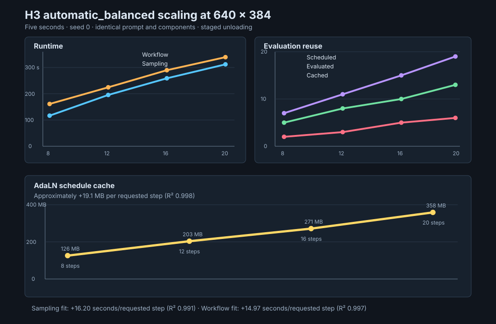

# H3 balanced EasyCache step scaling

## Conditions

The benchmark used five-second text-to-video-plus-audio generations at 640 by 384 pixels. Every run
used seed zero, the same prompt, the BF16 pruned transformer, the Q8 text encoder, and final video
and audio VAEs. Each weighted stage unloaded after use. The benchmark reused the verified eight-step
result and generated new 12-, 16-, and 20-step results.

The sampling time comes from each generation sidecar. The complete workflow time and AdaLN cache
size come from the ComfyUI execution log.

## Results

| Requested steps | Scheduled opportunities | Evaluations | Cached | Skip rate | Sampling | Workflow | AdaLN cache |
| ---: | ---: | ---: | ---: | ---: | ---: | ---: | ---: |
| 8 | 7 | 5 | 2 | 28.6% | 116.58 s | 161.14 s | 126 MB |
| 12 | 11 | 8 | 3 | 27.3% | 196.22 s | 225.50 s | 203 MB |
| 16 | 15 | 10 | 5 | 33.3% | 259.09 s | 288.91 s | 271 MB |
| 20 | 19 | 13 | 6 | 31.6% | 311.59 s | 339.61 s | 358 MB |

## Findings

Sampling time increased approximately 16.20 seconds per requested step across these four points.
The linear fit had an R-squared value of 0.991. Complete workflow time increased approximately
14.97 seconds per requested step, with an R-squared value of 0.997.

Balanced auto skipped 27 through 33 percent of scheduled transformer opportunities. The policy
reached its skip ceiling at every tested schedule. The no-consecutive rule produced an alternating
full-and-cached pattern until the ceiling was reached. The final schedule tail remained uncached.

The resolved threshold decreased from 0.80 at 8 and 12 steps to 0.56 at 16 steps and 0.44 at 20
steps. The live trajectory therefore selected a stricter threshold for denser schedules even though
the policy still reached its skip ceiling.

The AdaLN cache increased approximately 19.1 MB per requested step. The cache grew from 126 MB at
eight steps to 358 MB at 20 steps. This increase remains small relative to the transformer, but the
cache is not constant across schedules.

## Limitations

This benchmark uses one seed, one prompt, one duration, and one off-distribution smoke-test canvas.
The benchmark measures runtime scaling, not perceptual quality scaling. Evaluate motion, detail,
audio quality, and synchronization before selecting a production step count.
