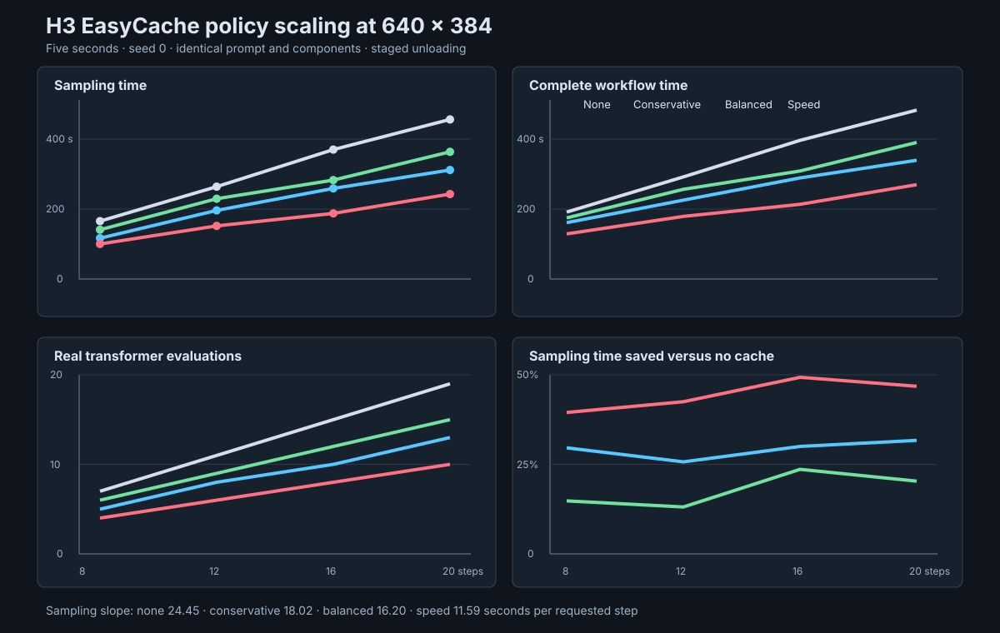

# H3 EasyCache policy and step scaling

## Conditions

The benchmark measured no EasyCache, conservative auto, balanced auto, and speed auto at 8, 12,
16, and 20 requested steps. Every generation used five seconds, 640 by 384 pixels, seed zero, the
same prompt, the BF16 pruned transformer, the Q8 text encoder, and the same final VAEs. Each weighted
stage unloaded after use.

The sampling time comes from each generation sidecar. The complete workflow time and AdaLN cache
size come from the ComfyUI execution log. The queue ran in step-major order. Within each new step
group, the order was no cache, conservative, then speed. Balanced results came from the preceding
benchmark session.

## Runtime results

| Steps | Policy | Evaluations | Cached | Sampling | Workflow | Sampling saving |
| ---: | --- | ---: | ---: | ---: | ---: | ---: |
| 8 | None | 7 | 0 | 165.56 s | 191.51 s | — |
| 8 | Conservative | 6 | 1 | 141.00 s | 174.74 s | 14.8% |
| 8 | Balanced | 5 | 2 | 116.58 s | 161.14 s | 29.6% |
| 8 | Speed | 4 | 3 | 100.15 s | 128.94 s | 39.5% |
| 12 | None | 11 | 0 | 264.03 s | 292.02 s | — |
| 12 | Conservative | 9 | 2 | 229.47 s | 256.55 s | 13.1% |
| 12 | Balanced | 8 | 3 | 196.22 s | 225.50 s | 25.7% |
| 12 | Speed | 6 | 5 | 151.82 s | 179.10 s | 42.5% |
| 16 | None | 15 | 0 | 369.94 s | 396.37 s | — |
| 16 | Conservative | 12 | 3 | 282.81 s | 308.76 s | 23.6% |
| 16 | Balanced | 10 | 5 | 259.09 s | 288.91 s | 30.0% |
| 16 | Speed | 8 | 7 | 187.62 s | 213.61 s | 49.3% |
| 20 | None | 19 | 0 | 456.25 s | 482.74 s | — |
| 20 | Conservative | 15 | 4 | 363.49 s | 390.38 s | 20.3% |
| 20 | Balanced | 13 | 6 | 311.59 s | 339.61 s | 31.7% |
| 20 | Speed | 10 | 9 | 242.78 s | 269.65 s | 46.8% |

## Scaling fits

| Policy | Sampling seconds per requested step | Sampling R-squared | Workflow seconds per requested step | Workflow R-squared |
| --- | ---: | ---: | ---: | ---: |
| None | 24.45 | 0.999 | 24.45 | 0.999 |
| Conservative | 18.02 | 0.992 | 17.48 | 0.993 |
| Balanced | 16.20 | 0.991 | 14.97 | 0.997 |
| Speed | 11.59 | 0.994 | 11.42 | 0.993 |

## Findings

Transformer evaluation count explains most runtime scaling. A full evaluation cost approximately
23 through 26 seconds at this canvas. Every automatic policy reduced the slope by increasing its
allowed skipped fraction as the schedule grew.

Conservative auto saved 13 through 24 percent of sampling time. Balanced auto saved 26 through 32
percent. Speed auto saved 40 through 49 percent. Workflow savings were smaller because text
encoding, model loading, VAE decoding, and publication do not benefit from EasyCache.

Every policy preserved the two calibration evaluations and final evaluation. Conservative and
balanced prohibited consecutive reuse. Speed used consecutive pairs on longer schedules.

## Limitations

Each point is one run with one prompt, seed, duration, and off-distribution canvas. Queue order and
system temperature were not randomized. The benchmark measures runtime, not perceptual quality.
Do not infer that a faster policy preserves motion, detail, or audio quality from timing alone.
